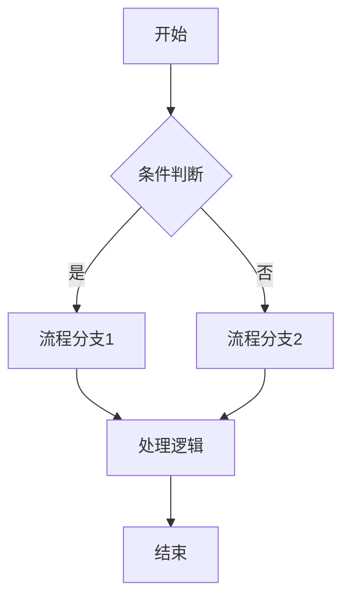
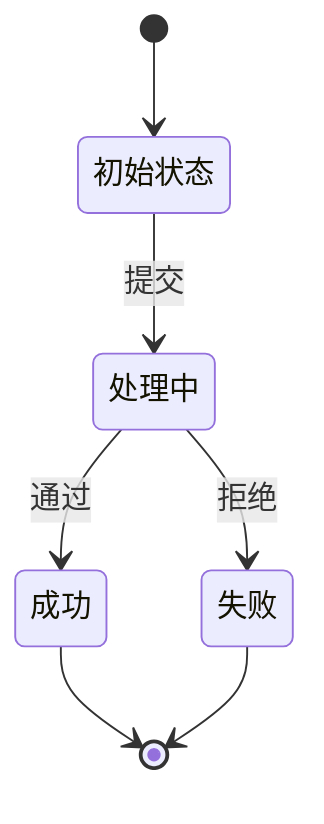

# 产品需求文档（PRD）模板

## 目录

- [标准 PRD 模板](#标准-prd-模板)
  - [1. 执行摘要](#1-执行摘要)
  - [2. 问题定义](#2-问题定义)
  - [3. 解决方案概述](#3-解决方案概述)
  - [4. 用户故事与需求](#4-用户故事与需求)
  - [5. 详细业务说明](#5-详细业务说明)
  - [6. UI 交互说明](#6-ui-交互说明)
  - [7. 权限说明](#7-权限说明)
  - [8. 附录](#8-附录)

---

## 标准 PRD 模板

### 1. 执行摘要
**目的**：面向高管和干系人的一页概览

#### 组件
- **问题陈述**（2-3 句）
- **建议方案**（2-3 句）
- **业务影响**（3 个要点）
- **时间线**（高层里程碑）
- **所需资源**（团队规模和预算）
- **成功指标**（3-5 个 KPI）

### 2. 问题定义

#### 2.1 客户问题
- **谁**：目标用户画像
- **什么**：具体问题或需求
- **何时**：上下文和频率
- **哪里**：环境和触点
- **为什么**：根本原因分析
- **影响**：不解决的成本

#### 2.2 市场机会
- **市场规模**：TAM、SAM、SOM
- **增长率**：年增长百分比
- **竞争**：当前解决方案和差距
- **时机**：为什么是现在？

#### 2.3 商业案例
- **收入潜力**：预期影响
- **成本节约**：效率提升
- **战略价值**：与公司目标对齐
- **风险评估**：不做的后果

### 3. 解决方案概述

#### 3.1 建议方案
- **高层描述**：我们要构建什么
- **核心能力**：主要功能
- **用户旅程**：端到端流程
- **差异化**：独特价值主张

#### 3.2 范围内
- 功能 1：描述和优先级
- 功能 2：描述和优先级
- 功能 3：描述和优先级

#### 3.3 范围外
- 明确我们不做的内容
- 未来考虑
- 对其他团队的依赖

#### 3.4 MVP 定义
- **核心功能**：最小可行功能集
- **成功标准**："可用"的定义
- **时间线**：MVP 交付日期
- **学习目标**：我们要验证什么

### 4. 用户故事与需求

#### 4.1 用户故事
```
作为一个 [角色]
我想要 [动作]
以便 [结果/收益]

验收标准：
- [ ] 标准 1
- [ ] 标准 2
- [ ] 标准 3
```

#### 4.2 功能需求
| ID | 需求 | 优先级 | 备注 |
|----|------|--------|------|
| FR1 | 用户可以... | P0 | MVP 关键 |
| FR2 | 系统应该... | P1 | 重要 |
| FR3 | 功能必须... | P2 | 最好有 |

#### 4.3 非功能需求
- **性能**：响应时间、吞吐量
- **可扩展性**：用户/数据增长目标
- **安全性**：身份验证、授权、数据保护
- **可靠性**：正常运行时间目标、错误率
- **可用性**：无障碍标准、设备支持
- **合规性**：法规要求

---

### 5. 详细业务说明

本模块基于安居乐隐产品架构师思维链（详见 [references/anjuleyu-thinking-chain.md](references/anjuleyu-thinking-chain.md)）进行设计。

#### 5.1 业务逻辑闭环

##### 5.1.1 业务边界与归属
- **归属系统**：[租务系统 / 小程序 / SCRM / BI]
- **功能定位**：[具体模块和环节]
- **边界定义**：明确本功能的业务边界，不涉及哪些业务范围

##### 5.1.2 新旧功能评估
- **功能类型**：[原有功能迭代 / 新功能]
- **核心影响**：
  - 是否涉及核心脆弱代码（签约计算、支付状态机、财务配平）？
  - 需要联动哪些现有模块？
- **风险评估**：
  - 可能的技术风险
  - 可能的业务风险

##### 5.1.3 数据流转闭环
- **数据源头**：数据从哪里录入？
- **数据流向**：数据最终落库在哪里？
- **字段映射**：跨系统时的字段映射关系
- **中间处理**：是否存在中间表或异步处理？

##### 5.1.4 第三方接口与异常处理
- **调用接口**：[法大大 / 公安系统 / 门锁 / 水表 / 支付等]
- **异常处理**：
  - 接口超时如何处理？
  - 回调失败如何处理？
  - 断网情况下如何降级？
- **降级策略**：明确的降级方案

#### 5.2 业务流程设计

##### 5.2.1 核心流程图（Mermaid）


##### 5.2.2 流程节点说明
- **节点 A**：[名称] - [说明]
- **节点 B**：[名称] - [说明]
- ...

##### 5.2.3 异常流程
- **异常场景 1**：[描述] -> [处理方式]
- **异常场景 2**：[描述] -> [处理方式]
- ...

#### 5.3 状态机定义

##### 5.3.1 状态列表
| 状态码 | 状态名称 | 说明 |
|--------|---------|------|
| STATE_01 | 初始状态 | 描述 |
| STATE_02 | 处理中 | 描述 |
| STATE_03 | 成功 | 描述 |
| STATE_04 | 失败 | 描述 |

##### 5.3.2 状态流转图


##### 5.3.3 状态转换规则
- **初始状态 → 处理中**：触发条件、前置校验
- **处理中 → 成功**：触发条件、后置处理
- **处理中 → 失败**：触发条件、失败处理
- ...

#### 5.4 业务规则

##### 5.4.1 核心规则
- **规则 1**：[描述]
- **规则 2**：[描述]
- ...

##### 5.4.2 校验规则
- **字段校验**：[字段名] - [校验规则] - [错误提示]
- **业务校验**：[业务逻辑] - [校验条件] - [错误提示]

##### 5.4.3 默认值与约束
- **默认值**：
  - [字段] = [默认值]
  - ...
- **约束条件**：
  - [约束 1]
  - [约束 2]

---

### 6. UI 交互说明

本模块基于安居乐隐产品架构师思维链（详见 [references/anjuleyu-thinking-chain.md](references/anjuleyu-thinking-chain.md)）进行设计。

#### 6.1 界面交互设计草案

##### 6.1.1 页面清单
列出所有涉及的新增/修改页面

| 序号 | 页面名称 | 终端类型 | 操作类型 | 说明 |
|------|---------|---------|---------|------|
| 1 | [页面名] | [小程序/PC后台/APP] | [新增/修改] | [说明] |
| 2 | [页面名] | [小程序/PC后台/APP] | [新增/修改] | [说明] |

##### 6.1.2 页面详情（逐页设计）

###### 【页面名称】
- **页面名称**：[页面名]
- **终端类型**：[小程序/PC后台/APP]
- **核心布局**：
  ```
  [描述界面结构]
  例如：顶部进度条 + 中间表单区域（5项必填）+ 底部固定提交按钮
  ```

- **字段交互细则**：
  | 字段名 | 类型 | 必填/选填 | 数据源 | 校验规则 | 默认值 | 说明 |
  |--------|------|-----------|--------|---------|--------|------|
  | [字段] | [类型] | [必填] | [来源] | [规则] | [值] | [说明] |

- **关键操作逻辑**：
  - **[操作名称]**：
    - 前置校验：[校验条件]
    - 后端处理：[处理逻辑]
    - 交互反馈：
      - 成功：[反馈方式]
      - 失败：[反馈方式]
      - Loading：[展示时机]

- **关键组件**：
  - ToB 参考：Element UI 组件库
  - ToC 参考：小程序原生组件规范

- **交互流转**：
  ```
  [描述交互流程]
  例如：点击提交 -> 出现二次确认弹窗（Element UI Dialog）-> 成功 Toast -> 跳转至详情页
  ```

#### 6.2 体验红线检查

##### 6.2.1 ToC 端（小程序）
- **加载反馈**：
  - 接口调用期间是否有 Loading？
  - Loading 展示的位置和样式
- **脱敏处理**：
  - 身份证、手机号是否已设计脱敏展示？
  - 脱敏规则是什么？
- **操作复杂度**：
  - 是否避免了"弹窗套弹窗"的糟糕体验？
  - 操作步骤是否简化到最少？

##### 6.2.2 ToB 端（PC/APP）
- **效率设计**：
  - 是否提供了筛选、搜索栏？
  - 是否支持批量操作？
  - 是否支持快捷键？

#### 6.3 状态机检查

自动补全所有中间状态的 UI 展示：

| 状态 | UI 表现 | 交互方式 | 说明 |
|------|---------|---------|------|
| Loading | [Loading 效果] | [不可操作] | [说明] |
| Success | [成功提示] | [下一步操作] | [说明] |
| Fail | [错误提示] | [重试/取消] | [说明] |
| Empty | [空状态页] | [引导操作] | [说明] |

#### 6.4 交互修正与回旋验证

当设计草案需要调整时，必须进行二轮红线扫描：
- **体验红线复查**：修改是否破坏原有交互逻辑？
- **一致性复查**：修改后的布局是否符合安居乐隐设计规范（Element UI/小程序规范）？

---

### 7. 权限说明

本模块基于安居乐隐 RBAC 模型（基于角色的访问控制）进行设计。

#### 7.1 权限矩阵

##### 7.1.1 角色定义
| 角色编码 | 角色名称 | 说明 |
|---------|---------|------|
| ROLE_ADMIN | 系统管理员 | 拥有所有权限 |
| ROLE_SHOP_MANAGER | 店长 | 管理门店范围内的资源 |
| ROLE_BUTLER | 管家 | 处理具体租务事务 |
| ROLE_FINANCE | 财务 | 处理财务相关操作 |

##### 7.1.2 功能权限矩阵
| 功能模块 | 操作 | 系统管理员 | 店长 | 管家 | 财务 | 说明 |
|---------|------|-----------|------|------|------|------|
| [模块名] | 查看 | ✅ | ✅ | ✅ | ❌ | [说明] |
| [模块名] | 新增 | ✅ | ✅ | ✅ | ❌ | [说明] |
| [模块名] | 编辑 | ✅ | ✅ | ❌ | ❌ | [说明] |
| [模块名] | 删除 | ✅ | ❌ | ❌ | ❌ | [说明] |
| [模块名] | 审批 | ✅ | ❌ | ❌ | ✅ | [说明] |

#### 7.2 数据隔离

##### 7.2.1 数据范围
| 角色 | 数据范围 | 说明 |
|------|---------|------|
| 系统管理员 | 全部数据 | 可查看所有门店数据 |
| 店长 | 本门店数据 | 仅可查看和管理本门店数据 |
| 管家 | 本门店数据 | 仅可查看和管理本门店数据 |
| 财务 | 全部数据 | 可查看所有财务数据 |

##### 7.2.2 字段级权限
| 字段 | 系统管理员 | 店长 | 管家 | 财务 | 说明 |
|------|-----------|------|------|------|------|
| [字段] | 可见可编辑 | 可见可编辑 | 仅可见 | 仅可见 | [说明] |
| [字段] | 可见可编辑 | 仅可见 | 不可见 | 可见可编辑 | [说明] |

#### 7.3 高风险操作审批

##### 7.3.1 高风险操作列表
| 操作 | 风险等级 | 审批流程 | 说明 |
|------|---------|---------|------|
| 系统还原 | 高 | 店长 → 战区总 → 中台 | 可能影响历史数据 |
| 删除合同 | 高 | 店长 → 战区总 → 中台 | 财务影响大 |
| 修改水电底数 | 高 | 管家 → 店长 → 财务 | 影响账单计算 |

##### 7.3.2 审批流程
- **标准流程**：管家 → 店长
- **特殊流程**：根据具体操作走相应审批链
- **审批记录**：所有审批操作必须记录审批人、审批时间、审批意见

#### 7.4 权限开通流程

- **标准岗位权限**：店长、管家自带基础权限，无需审批
- **特殊权限开通**：
  - 需要走邮件审批流程
  - 发送给：连正一 / 周安琪
  - 审批通过后由 IT 开通

---

### 8. 附录

- 用户研究数据
- 竞品分析
- 技术图表
- 法律/合规文档
