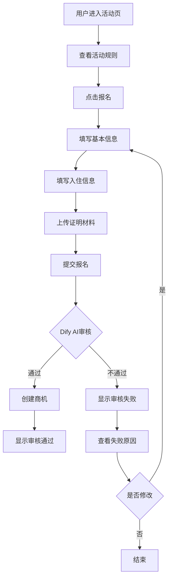
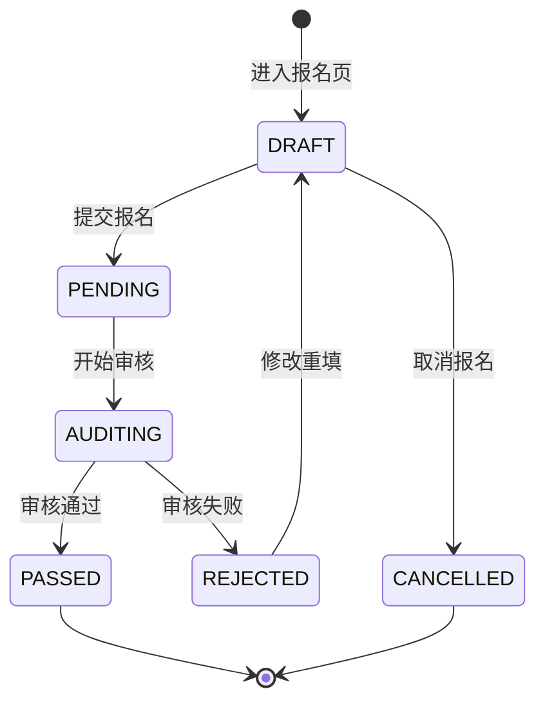

  # 深梦团聚-春节免费住 小程序报名入口 PRD

## 1. 执行摘要

### 问题陈述

"深梦团聚-春节免费住"公益活动面向春节期间保障城市运行的新就业群体和城市建设者，提供500套免费房源。当前缺乏便捷的线上报名入口，用户需要通过线下或传统方式报名，效率低且审核流程不透明。

### 建议方案

在安居乐寓微信小程序中开发"深梦团聚"活动报名入口，用户在线填写申请信息并上传证明材料，通过Dify AI Agent进行智能审核，审核通过后自动创建商机，审核不通过则提供详细的修改指引。

### 业务影响

* 提升报名效率：用户可随时随地提交报名申请

* 降低人工成本：AI智能审核替代人工初审

* 提高转化率：实时反馈审核结果，引导用户完善资料

### 时间线

* MVP版本：2周

* 完整版本：4周

### 成功指标

* 报名转化率 ≥ 60%

* 审核通过率 ≥ 40%

* 用户满意度 ≥ 4.0/5.0

***

## 2. 问题定义

### 2.1 客户问题

* **谁**：在深工作的快递员、网约配送员、网约车司机、货车司机四类新就业群体，以及保障房建筑工人、公交车司机、地铁一线运营服务人员等城市建设者

* **什么**：缺乏便捷的线上报名渠道，无法实时了解审核进度

* **何时**：2026年2月1日-2月28日活动期间

* **哪里**：微信小程序端

* **为什么**：传统报名方式效率低，审核流程不透明

* **影响**：用户报名意愿降低，活动参与度不足

### 2.2 市场机会

* 目标用户群体庞大：深圳新就业群体数量众多

* 活动资源有限：500套房源，先到先得

* 时效性强：春节期间集中需求

### 2.3 商业案例

* 品牌价值：体现企业社会责任，提升品牌形象

* 用户转化：免费住用户可能转化为长期租客

* 数据积累：收集目标用户画像数据

***

## 3. 解决方案概述

### 3.1 建议方案

#### 系统架构

```
用户 → 小程序报名表单 → Dify AI审核 → 审核结果反馈
                                    ↓
                            审核通过 → 创建商机 → SCRM跟进
```

#### 核心能力

1. **在线报名**：用户填写申请信息，上传证明材料
2. **AI智能审核**：Dify Agent自动审核资格和材料
3. **实时反馈**：审核结果实时展示，不通过时提供修改指引
4. **商机创建**：审核通过后自动创建商机，分配管家跟进

### 3.2 范围内

* 小程序活动入口页面

* 报名表单页面（分步填写）

* 审核结果展示页面

* 审核失败详情页面

* Dify Agent审核接口对接

* 商机创建接口对接

### 3.3 范围外

* PC端审核管理功能（使用现有SCRM）

* 签约入住流程（使用现有租务系统）

* 支付功能（线下收取押金和服务费）

### 3.4 MVP定义

* **核心功能**：报名表单提交 + AI审核 + 结果反馈

* **成功标准**：用户可完成报名并收到审核结果

* **时间线**：2周内上线

***

## 4. 用户故事与需求

### 4.1 用户故事

#### 故事1：活动报名

```
作为一个 新就业群体用户
我想要 通过小程序报名参加深梦团聚活动
以便 获得春节期间免费住宿的机会

验收标准：
- [ ] 可以查看活动介绍和规则
- [ ] 可以填写报名信息
- [ ] 可以上传证明材料
- [ ] 提交后收到报名确认
```

#### 故事2：审核反馈

```
作为一个 报名用户
我想要 实时查看审核结果
以便 了解是否通过审核，不通过时知道如何修改

验收标准：
- [ ] 可以查看审核状态
- [ ] 审核通过时显示成功信息
- [ ] 审核不通过时显示具体原因和修改建议
- [ ] 可以重新提交修改后的资料
```

### 4.2 功能需求

| ID  | 需求                    | 优先级 | 备注    |
| --- | --------------------- | --- | ----- |
| FR1 | 用户可以查看活动介绍和规则         | P0  | MVP关键 |
| FR2 | 用户可以填写申请信息（基本信息、入住信息） | P0  | MVP关键 |
| FR3 | 用户可以上传证明材料（身份认证、关系证明） | P0  | MVP关键 |
| FR4 | 系统调用Dify进行AI审核        | P0  | MVP关键 |
| FR5 | 审核结果实时展示              | P0  | MVP关键 |
| FR6 | 审核不通过时提供修改指引          | P0  | MVP关键 |
| FR7 | 审核通过后自动创建商机           | P0  | MVP关键 |
| FR8 | 用户可以修改并重新提交资料         | P1  | 重要    |
| FR9 | 用户可以查看报名历史            | P2  | 最好有   |

### 4.3 非功能需求

* **性能**：页面加载时间 < 2秒，审核响应时间 < 10秒

* **安全性**：身份证号、手机号等敏感信息加密存储

* **可用性**：支持微信小程序基础库 2.10.0 及以上

* **兼容性**：支持 iOS 和 Android 微信客户端

***

## 5. 详细业务说明

### 5.1 业务逻辑闭环

#### 5.1.1 业务边界与归属

* **归属系统**：小程序端

* **功能定位**：活动报名模块

* **边界定义**：

  * 包含：报名表单、审核反馈、商机创建触发

  * 不包含：签约流程、支付流程、房源管理

#### 5.1.2 新旧功能评估

* **功能类型**：新功能

* **参考系统**：深梦扬帆2.0报名流程

* **核心影响**：

  * 需新建活动报名入口

  * 需对接Dify AI审核系统

  * 需对接商机创建接口

#### 5.1.3 数据流转闭环

* **数据源头**：小程序用户填写

* **数据流向**：

  1. 小程序表单提交 → 后端接口
  2. 后端接口 → Dify审核
  3. Dify审核结果 → 小程序展示
  4. 审核通过 → 商机创建接口

* **字段映射**：见下方字段定义

#### 5.1.4 第三方接口与异常处理

* **Dify Agent API**：

  * 审核接口：POST /api/dify/audit

  * 商机创建：POST /api/dify/create-opportunity

* **异常处理**：

  * 接口超时：提示用户稍后重试，保留已填写数据

  * 审核失败：显示具体原因，引导用户修改

  * 网络异常：本地缓存表单数据，恢复网络后重试

### 5.2 业务流程设计

#### 5.2.1 核心流程图



#### 5.2.2 流程节点说明

* **节点A**：用户通过小程序金刚位或活动Banner进入活动页

* **节点B**：展示活动规则、服务对象、活动权益等信息

* **节点C**：用户确认符合条件后点击报名按钮

* **节点D-F**：分步填写表单，支持暂存和回退

* **节点G**：提交前进行本地校验，校验通过后调用后端接口

* **节点H**：Dify AI审核，包含资格审核和材料审核

* **节点I**：审核通过后自动创建商机，分配对应门店管家

* **节点K**：审核不通过时，展示具体的失败原因和修改建议

#### 5.2.3 异常流程

* **网络异常**：提示"网络异常，请检查网络后重试"，保留已填写数据

* **审核超时**：提示"审核中，请稍后查看结果"，支持主动查询

* **材料上传失败**：提示"上传失败，请重试"，支持重新上传

### 5.3 状态机定义

#### 5.3.1 状态列表

| 状态码       | 状态名称 | 说明            |
| --------- | ---- | ------------- |
| DRAFT     | 草稿   | 用户填写中，未提交     |
| PENDING   | 待审核  | 已提交，等待AI审核    |
| AUDITING  | 审核中  | Dify正在审核      |
| PASSED    | 审核通过 | 审核通过，已创建商机    |
| REJECTED  | 审核失败 | 审核不通过，可修改重新提交 |
| CANCELLED | 已取消  | 用户取消报名        |

#### 5.3.2 状态流转图



#### 5.3.3 状态转换规则

* **DRAFT → PENDING**：用户点击提交，本地校验通过

* **PENDING → AUDITING**：后端调用Dify审核接口

* **AUDITING → PASSED**：Dify返回审核通过

* **AUDITING → REJECTED**：Dify返回审核失败

* **REJECTED → DRAFT**：用户点击修改

### 5.4 业务规则

#### 5.4.1 核心规则

**服务对象资格校验**：

1. 申请人必须属于以下职业类别之一：

   * 快递员

   * 网约配送员

   * 网约车司机

   * 货车司机

   * 保障房建筑工人

   * 公交车司机

   * 地铁一线运营服务人员

2. 申请人年龄须为18周岁及以上

3. 需至少包含一名直系亲属入住

**材料审核规则**：

| 职业类别       | 必要证明材料              |
| ---------- | ------------------- |
| 快递员        | 身份证 + 工作证/接单证明/社保证明 |
| 网约配送员      | 身份证 + 工作证/接单证明/社保证明 |
| 网约车司机      | 身份证 + 工作证/接单证明/社保证明 |
| 货车司机       | 身份证 + 工作证/接单证明/社保证明 |
| 保障房建筑工人    | 身份证 + 总包单位盖章确认证明    |
| 公交车司机      | 身份证 + 工作证/社保证明      |
| 地铁一线运营服务人员 | 身份证 + 工作证/社保证明      |

**同住人审核规则**：

* 同住人需提供有效证明材料证明与申请人的亲属关系

* 可接受的证明材料：户口本、出生证明、结婚证等

#### 5.4.2 校验规则

| 字段名     | 校验规则          | 错误提示       |
| ------- | ------------- | ---------- |
| 申请人姓名   | 必填，2-20个字符    | 请输入真实姓名    |
| 申请人身份证号 | 必填，18位身份证格式校验 | 请输入正确的身份证号 |
| 联系方式    | 必填，11位手机号格式校验 | 请输入正确的手机号  |
| 职业类别    | 必填，从预设列表选择    | 请选择职业类别    |
| 拟入住人数   | 必填，1-10人      | 请输入入住人数    |
| 入住时间    | 必填，在活动时间范围内   | 请选择入住时间    |
| 关系证明    | 必填，至少上传1张     | 请上传关系证明材料  |
| 身份认证    | 必填，至少上传1张     | 请上传身份认证材料  |

#### 5.4.3 默认值与约束

* **默认值**：

  * 计划居住天数 = 15天

  * 申请时间 = 当前时间

* **约束条件**：

  * 入住时间范围：2026年2月1日 - 2026年2月14日

  * 最晚办理入住时间：2026年2月14日

  * 每人仅享受一次15天免费住权益

***

## 6. UI 交互说明

### 6.1 界面交互设计草案

#### 6.1.1 页面清单

| 序号 | 页面名称       | 终端类型 | 操作类型 | 说明          |
| -- | ---------- | ---- | ---- | ----------- |
| 1  | 活动首页       | 小程序  | 新增   | 活动介绍、报名入口   |
| 2  | 报名表单页-基本信息 | 小程序  | 新增   | 填写申请人基本信息   |
| 3  | 报名表单页-入住信息 | 小程序  | 新增   | 填写入住相关信息    |
| 4  | 报名表单页-材料上传 | 小程序  | 新增   | 上传证明材料      |
| 5  | 审核结果页      | 小程序  | 新增   | 展示审核结果      |
| 6  | 审核失败详情页    | 小程序  | 新增   | 展示失败原因和修改建议 |

#### 6.1.2 页面详情

##### 【活动首页】

* **页面名称**：深梦团聚活动首页

* **终端类型**：小程序

* **核心布局**：

  ```
  顶部：活动Banner图
  中部：活动介绍（服务对象、活动权益、活动规则）
  底部：固定【立即报名】按钮
  ```

* **字段交互细则**：

  | 字段名      | 类型 | 必填/选填 | 数据源  | 校验规则 | 默认值 | 说明        |
  | -------- | -- | ----- | ---- | ---- | --- | --------- |
  | 活动Banner | 图片 | -     | 静态资源 | -    | -   | 活动主视觉     |
  | 服务对象     | 文本 | -     | 静态配置 | -    | -   | 7类服务对象说明  |
  | 活动权益     | 文本 | -     | 静态配置 | -    | -   | 15天免费住等权益 |

* **关键操作逻辑**：

  * **【立即报名】**：

    * 前置校验：检查用户是否已报名

    * 后端处理：无

    * 交互反馈：

      * 未报名：跳转至报名表单页

      * 已报名：跳转至审核结果页

* **关键组件**：

  * Banner组件：支持点击放大

  * 规则折叠面板：默认折叠，点击展开

* **交互流转**：

  ```
  点击【立即报名】→ 检查报名状态 → 未报名：跳转报名表单 / 已报名：跳转审核结果
  ```

##### 【报名表单页-基本信息】

* **页面名称**：报名表单-基本信息

* **终端类型**：小程序

* **核心布局**：

  ```
  顶部：步骤指示器（1/3）
  中部：表单区域
  底部：固定【下一步】按钮
  ```

* **字段交互细则**：

  | 字段名     | 类型   | 必填/选填 | 数据源   | 校验规则     | 默认值       | 说明     |
  | ------- | ---- | ----- | ----- | -------- | --------- | ------ |
  | 申请人姓名   | 文本输入 | 必填    | 用户输入  | 2-20字符   | -         | 需为真实姓名 |
  | 申请人身份证号 | 文本输入 | 必填    | 用户输入  | 18位身份证格式 | -         | 用于年龄校验 |
  | 性别      | 单选   | 必填    | 用户选择  | -        | 根据身份证自动识别 | 男/女    |
  | 联系方式    | 文本输入 | 必填    | 用户输入  | 11位手机号   | -         | 用于后续联系 |
  | 职业类别    | 单选   | 必填    | 预设列表  | -        | -         | 7类职业   |
  | 工作区域    | 级联选择 | 选填    | 行政区数据 | -        | -         | 深圳各区   |

* **关键操作逻辑**：

  * **【下一步】**：

    * 前置校验：所有必填项已填写且格式正确

    * 后端处理：暂存表单数据

    * 交互反馈：

      * 成功：跳转至入住信息页

      * 失败：Toast提示具体错误

* **关键组件**：

  * 步骤指示器：显示当前步骤

  * 表单组件：使用小程序原生input、radio组件

  * 身份证识别：自动识别性别和年龄

* **交互流转**：

  ```
  填写完成 → 点击【下一步】→ 本地校验 → 通过：跳转入住信息 / 失败：提示错误
  ```

##### 【报名表单页-入住信息】

* **页面名称**：报名表单-入住信息

* **终端类型**：小程序

* **核心布局**：

  ```
  顶部：步骤指示器（2/3）
  中部：表单区域
  底部：固定【上一步】【下一步】按钮
  ```

* **字段交互细则**：

  | 字段名     | 类型   | 必填/选填 | 数据源  | 校验规则    | 默认值 | 说明            |
  | ------- | ---- | ----- | ---- | ------- | --- | ------------- |
  | 拟入住人数   | 数字输入 | 必填    | 用户输入 | 1-10人   | -   | 含申请人本人        |
  | 拟入住人员关系 | 文本输入 | 必填    | 用户输入 | -       | -   | 与申请人的关系       |
  | 入住时间    | 日期选择 | 必填    | 用户选择 | 活动时间范围内 | -   | 2026.2.1-2.14 |
  | 计划居住天数  | 数字输入 | 必填    | 用户输入 | 1-15天   | 15  | 最长15天         |
  | 申请门店    | 级联选择 | 选填    | 门店数据 | -       | -   | 意向门店          |

* **关键操作逻辑**：

  * **【上一步】**：

    * 交互反馈：返回基本信息页，保留已填写数据

  * **【下一步】**：

    * 前置校验：所有必填项已填写

    * 交互反馈：跳转至材料上传页

* **交互流转**：

  ```
  点击【上一步】→ 返回基本信息页
  填写完成 → 点击【下一步】→ 本地校验 → 通过：跳转材料上传 / 失败：提示错误
  ```

##### 【报名表单页-材料上传】

* **页面名称**：报名表单-材料上传

* **终端类型**：小程序

* **核心布局**：

  ```
  顶部：步骤指示器（3/3）
  中部：上传区域（身份认证、关系证明）
  底部：固定【上一步】【提交报名】按钮
  ```

* **字段交互细则**：

  | 字段名    | 类型   | 必填/选填 | 数据源  | 校验规则      | 默认值 | 说明            |
  | ------ | ---- | ----- | ---- | --------- | --- | ------------- |
  | 身份认证材料 | 图片上传 | 必填    | 用户上传 | 至少1张，最多4张 | -   | 工作证/接单证明/社保证明 |
  | 关系证明材料 | 图片上传 | 必填    | 用户上传 | 至少1张，最多4张 | -   | 户口本/出生证明/结婚证  |

* **关键操作逻辑**：

  * **【上传图片】**：

    * 前置校验：图片格式（jpg/png）、大小（<5MB）

    * 后端处理：上传至OSS

    * 交互反馈：

      * 成功：显示缩略图

      * 失败：Toast提示上传失败

  * **【提交报名】**：

    * 前置校验：所有必填项已填写，材料已上传

    * 后端处理：提交报名数据，调用Dify审核

    * 交互反馈：

      * 成功：跳转至审核结果页

      * 失败：Toast提示具体错误

* **关键组件**：

  * 图片上传组件：支持相机拍照、相册选择

  * 图片预览组件：点击放大查看

* **交互流转**：

  ```
  上传材料 → 点击【提交报名】→ 本地校验 → 调用后端接口 → 跳转审核结果页
  ```

##### 【审核结果页】

* **页面名称**：审核结果

* **终端类型**：小程序

* **核心布局**：

  ```
  顶部：状态图标（通过/失败/审核中）
  中部：结果说明
  底部：操作按钮
  ```

* **状态展示**：

  | 状态   | 图标   | 颜色 | 说明文字                |
  | ---- | ---- | -- | ------------------- |
  | 审核中  | 加载动画 | 蓝色 | 您的申请正在审核中，请耐心等待...  |
  | 审核通过 | 对勾   | 绿色 | 恭喜您，审核通过！管家将尽快与您联系。 |
  | 审核失败 | 感叹号  | 红色 | 审核未通过，点击查看详情        |

* **关键操作逻辑**：

  * **审核通过状态**：

    * 显示：管家联系方式、预计入住时间

    * 按钮：【查看活动详情】【联系管家】

  * **审核失败状态**：

    * 按钮：【查看详情】【重新申请】

  * **审核中状态**：

    * 按钮：【返回首页】

* **交互流转**：

  ```
  审核通过 → 点击【联系管家】→ 拨打电话
  审核失败 → 点击【查看详情】→ 跳转失败详情页
  ```

##### 【审核失败详情页】

* **页面名称**：审核失败详情

* **终端类型**：小程序

* **核心布局**：

  ```
  顶部：失败原因分类
  中部：具体原因列表 + 修改建议
  底部：固定【修改资料】按钮
  ```

* **失败原因分类**：

  | 分类    | 说明         | 修改建议                     |
  | ----- | ---------- | ------------------------ |
  | 资格不符  | 不属于服务对象范围  | 您的职业不在活动服务范围内，感谢您的关注     |
  | 资料不全  | 缺少必要证明材料   | 请补充上传XX证明材料              |
  | 资料不符  | 材料与填写信息不匹配 | 您上传的证明材料与填写信息不符，请核实后重新上传 |
  | 非直系亲属 | 同住人非直系亲属   | 同住人需为直系亲属，请提供关系证明        |

* **关键操作逻辑**：

  * **【修改资料】**：

    * 交互反馈：跳转至报名表单页，预填已填写数据

### 6.2 体验红线检查

#### 6.2.1 ToC 端（小程序）

* **加载反馈**：

  * 所有接口调用期间显示Loading

  * 图片上传显示进度条

  * 审核中状态显示加载动画

* **脱敏处理**：

  * 身份证号：显示前6位和后4位，中间用\*代替

  * 手机号：显示前3位和后4位，中间用\*代替

* **操作复杂度**：

  * 分步表单，每步不超过5个字段

  * 支持暂存和回退

  * 避免弹窗套弹窗

#### 6.2.2 状态机检查

| 状态        | UI 表现  | 交互方式       | 说明      |
| --------- | ------ | ---------- | ------- |
| DRAFT     | 表单填写页  | 可编辑、可暂存    | 用户填写中   |
| PENDING   | 提交成功提示 | 等待跳转       | 提交后短暂状态 |
| AUDITING  | 审核中页面  | 不可操作       | 显示加载动画  |
| PASSED    | 审核通过页面 | 可查看详情、联系管家 | 显示成功信息  |
| REJECTED  | 审核失败页面 | 可查看详情、修改重填 | 显示失败原因  |
| CANCELLED | 取消确认页  | 可重新报名      | 用户主动取消  |

***

## 7. 权限说明

### 7.1 权限矩阵

#### 7.1.1 角色定义

| 角色编码                | 角色名称 | 说明            |
| ------------------- | ---- | ------------- |
| ROLE\_USER          | 普通用户 | 小程序用户，可报名参与活动 |
| ROLE\_BUTLER        | 管家   | 跟进审核通过的商机     |
| ROLE\_SHOP\_MANAGER | 店长   | 管理门店范围内的活动数据  |

#### 7.1.2 功能权限矩阵

| 功能模块 | 操作 | 普通用户 | 管家 | 店长 | 说明      |
| ---- | -- | ---- | -- | -- | ------- |
| 活动首页 | 查看 | ✅    | ✅  | ✅  | 所有人可查看  |
| 报名表单 | 提交 | ✅    | ✅  | ✅  | 所有人可报名  |
| 审核结果 | 查看 | ✅    | ✅  | ✅  | 仅可查看自己的 |
| 商机跟进 | 查看 | ❌    | ✅  | ✅  | 仅管家和店长  |

### 7.2 数据隔离

#### 7.2.1 数据范围

| 角色   | 数据范围  | 说明          |
| ---- | ----- | ----------- |
| 普通用户 | 本人数据  | 仅可查看自己的报名记录 |
| 管家   | 本门店数据 | 可查看分配给自己的商机 |
| 店长   | 本门店数据 | 可查看门店所有商机   |

***

## 8. 附录

### 8.1 报名字段定义

基于Excel表格"入住信息审核-乐寓"sheet的字段定义：

#### 申请信息字段

| 字段名      | 字段编码                 | 类型       | 必填 | 说明            |
| -------- | -------------------- | -------- | -- | ------------- |
| 更新时间     | update\_time         | datetime | 自动 | 系统自动记录        |
| 申请门店     | apply\_store         | string   | 选填 | 意向门店          |
| 申请时间     | apply\_time          | datetime | 自动 | 系统自动记录        |
| 是否企业通道客户 | is\_enterprise       | boolean  | 自动 | 企业通道标记        |
| 拟入住人数    | guest\_count         | int      | 必填 | 含本人           |
| 拟入住人员关系  | guest\_relation      | string   | 必填 | 与申请人关系        |
| 关系证明1-4  | relation\_proof\_1-4 | file     | 必填 | 至少1张          |
| 入住时间     | check\_in\_date      | date     | 必填 | 2026.2.1-2.14 |
| 计划居住天数   | stay\_days           | int      | 必填 | 最长15天         |

#### 个人信息字段

| 字段名     | 字段编码            | 类型     | 必填 | 说明      |
| ------- | --------------- | ------ | -- | ------- |
| 申请人姓名   | applicant\_name | string | 必填 | 真实姓名    |
| 申请人身份证号 | applicant\_id   | string | 必填 | 18位身份证  |
| 性别      | gender          | string | 自动 | 根据身份证识别 |
| 联系方式    | phone           | string | 必填 | 11位手机号  |
| 职业类别    | occupation      | string | 必填 | 7类职业    |
| 身份认证1-3 | id\_proof\_1-3  | file   | 必填 | 至少1张    |
| 工作区域    | work\_area      | string | 选填 | 行政区     |

#### 审核相关字段

| 字段名    | 字段编码               | 类型     | 说明            |
| ------ | ------------------ | ------ | ------------- |
| 对接管家   | butler             | string | 审核通过后分配       |
| 审核状态   | audit\_status      | string | 待审核/审核中/通过/失败 |
| 审核情况说明 | audit\_remark      | string | 审核结果说明        |
| 审核失败原因 | reject\_reason     | string | 失败原因分类        |
| 修改建议   | modify\_suggestion | string | Dify返回的修改建议   |

### 8.2 Dify审核接口规范

#### 审核接口

```
POST /api/dify/audit

Request:
{
  "applicant_name": "张三",
  "applicant_id": "440305199001011234",
  "phone": "13800138000",
  "occupation": "快递员",
  "guest_count": 3,
  "guest_relation": "父母、子女",
  "check_in_date": "2026-02-05",
  "stay_days": 15,
  "id_proofs": ["url1", "url2"],
  "relation_proofs": ["url1", "url2"]
}

Response:
{
  "code": 0,
  "data": {
    "audit_result": "pass", // pass/reject
    "reject_reason": null, // 审核失败时返回
    "modify_suggestion": null, // 审核失败时返回修改建议
    "opportunity_id": "12345" // 审核通过时返回商机ID
  }
}
```

### 8.3 职业类别选项

| 序号 | 职业类别       | 必要证明材料              |
| -- | ---------- | ------------------- |
| 1  | 快递员        | 身份证 + 工作证/接单证明/社保证明 |
| 2  | 网约配送员      | 身份证 + 工作证/接单证明/社保证明 |
| 3  | 网约车司机      | 身份证 + 工作证/接单证明/社保证明 |
| 4  | 货车司机       | 身份证 + 工作证/接单证明/社保证明 |
| 5  | 保障房建筑工人    | 身份证 + 总包单位盖章确认证明    |
| 6  | 公交车司机      | 身份证 + 工作证/社保证明      |
| 7  | 地铁一线运营服务人员 | 身份证 + 工作证/社保证明      |

### 8.4 审核失败原因分类

| 分类编码                   | 分类名称  | 说明         | 修改建议示例                        |
| ---------------------- | ----- | ---------- | ----------------------------- |
| NOT\_QUALIFIED         | 资格不符  | 不属于服务对象范围  | 您的职业不在活动服务范围内，感谢您的关注          |
| MATERIAL\_INCOMPLETE   | 资料不全  | 缺少必要证明材料   | 请补充上传工作证明材料，如工作证、接单截图或社保证明    |
| MATERIAL\_MISMATCH     | 资料不符  | 材料与填写信息不匹配 | 您上传的证明材料与填写的职业信息不符，请核实后重新上传   |
| NOT\_IMMEDIATE\_FAMILY | 非直系亲属 | 同住人非直系亲属   | 同住人需为直系亲属（父母、配偶、子女），请提供关系证明材料 |
| AGE\_LIMIT             | 年龄不符  | 申请人未满18周岁  | 申请人需年满18周岁                    |
| DUPLICATE\_APPLY       | 重复申请  | 已参加过活动     | 每人仅享受一次15天免费住权益               |

