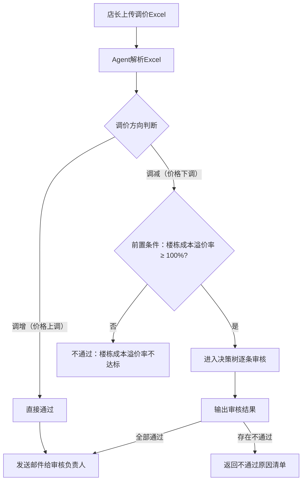
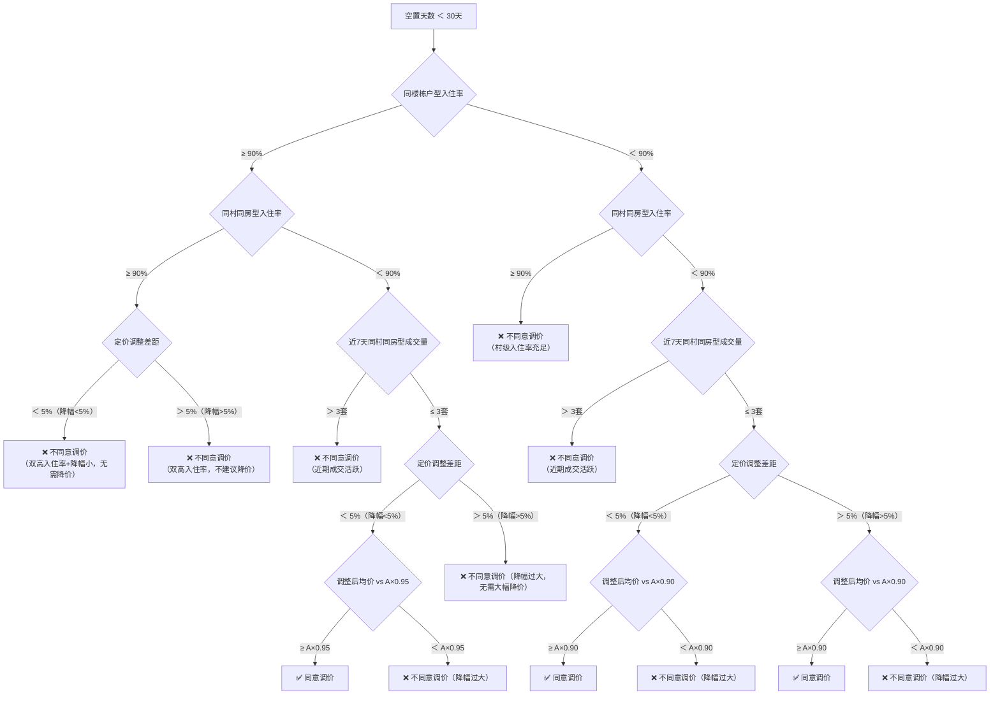

# 门店调价审核 Agent PRD

> **文档版本**：v1.0  
> **创建日期**：2026-03-26  
> **产品负责人**：Kyle  
> **技术方案**：Dify 智能体/工作流 + MCP 数据接入

---

## 1. 执行摘要

### 问题陈述
当前门店店长调整房源价格时，需要定价审核负责人逐条人工审核，耗时且标准不统一。需要一个 AI Agent 来自动化审核流程，按统一规则判断调价是否合理。

### 建议方案
基于 Dify 平台构建「门店调价审核 Agent」，店长上传调价 Excel 文件后，Agent 自动解析文件、通过 MCP 获取房源实时数据、按照定价审核规则逐条判断，最终输出审核结果。审核通过则自动发送邮件通知审核负责人，不通过则返回不通过原因。

### 业务影响
- **效率提升**：审核耗时从人工数小时缩短至分钟级
- **标准统一**：消除人工审核的主观偏差，100% 按规则执行
- **流程闭环**：审核通过自动发送邮件存档，形成完整审批链

### 成功指标
- 审核准确率 ≥ 95%（与人工审核结果对照）
- 单次审核耗时 < 3 分钟
- 店长满意度 ≥ 80%

---

## 2. 用户故事

```
作为一个 门店店长
我想要 上传调价Excel文件给AI Agent，自动完成价格审核
以便 快速获得审核结论，不用等待人工审批

验收标准：
- [ ] 上传Excel后Agent能正确解析房间号和调整后价格
- [ ] Agent能按规则逐条审核每个房间的调价
- [ ] 审核不通过时返回具体不通过原因
- [ ] 审核通过时自动发送邮件（附Excel附件）给审核负责人
- [ ] 调增场景直接通过并发送邮件
```

---

## 3. 解决方案概述

### 3.1 技术架构

```
┌──────────────┐     ┌──────────────────────────────────┐     ┌──────────────┐
│   店长       │     │       Dify Agent / Workflow       │     │   MCP 服务    │
│  （上传Excel）│────▶│                                  │────▶│  （房源数据）  │
│              │     │  1. 解析Excel                    │     │              │
│              │◀────│  2. 调用MCP获取数据              │◀────│              │
│              │     │  3. 执行审核规则                  │     └──────────────┘
│              │     │  4. 输出审核结果                  │
│              │     │  5. 通过则发送邮件                │────▶ 📧 审核负责人
│              │     └──────────────────────────────────┘
└──────────────┘
```

### 3.2 核心能力
1. **Excel 文件解析**：解析店长上传的新定价模型Excel，提取【4】价目表中的房号+调整后价格，以及【2】审核标准中的楼栋成本溢价率
2. **MCP 数据查询**：通过 MCP 获取房源实时数据（入住率、空置天数、成交量等）
3. **规则引擎**：按决策树逻辑判断每条调价是否合理
4. **邮件通知**：审核通过后自动发送邮件（含Excel附件）

### 3.3 范围外（本期不做）
- 前端审核页面开发
- 与现有审批系统的集成

---

## 4. 数据源定义

### 4.1 店长上传的 Excel 文件

参照「新定价模型 V2.5」格式，Agent 需要读取以下关键 sheet：

#### 【4】价目表
包含所有房间的定价信息：

| 数据项 | 说明 | 示例 |
|-------|------|------|
| 楼层 | 所在楼层 | 2层 |
| 房号 | 房间编号 | 201、202... |
| 户型 | 户型代码 | A、B、C... |
| 价格 | 调整后价格（元/月） | 4000 |

#### 【2】运营中心填-基本信息&审核标准
包含楼栋级别的成本和审核信息：

| 数据项 | 说明 | 示例 |
|-------|------|------|
| 小区（村） | 所属村 | 永丰八区 |
| 楼栋号 | 楼栋名称 | 永丰四区51栋 |
| 成本溢价率 | 定价坪效/成本标准单价 | 0.807 |
| check | 成本线是否通过 | 通过/不通过 |
| 总销售单元数 | 本栋总房间数 | 160.5 |

### 4.2 MCP 数据表（三表结构）

Agent 通过 MCP 工具查询 **3 张数据表**，通过「楼栋」字段关联：

#### 表1：`de_定价agent数据集`（房源主表）

| 字段 | 类型 | 说明 | 用途 |
|------|------|------|------|
| 村 | 文本 | 所属村 | 计算同村入住率、均价 |
| 楼栋 | 文本 | 所属楼栋 | 计算同楼栋户型入住率；关联其他两张表 |
| 楼层 | 数字 | 所在楼层 | 房型分类 |
| 房间号 | 文本 | 房间编号 | 匹配Excel调价记录 |
| 户型 | 文本 | 格局类型（开间/一居室/二居室等） | 房型分类 |
| 资产户型 | 文本 | 户型资产代码（A/B/C...） | 计算同楼栋户型入住率 |
| 采光系数 | 数字 | 采光等级（1-5） | 房型分类 |
| 阳台 | 文本 | 有/无 | 房型分类 |
| 面积 | 数字 | 套内面积（㎡） | 房型分类 |
| 是否电梯房 | 文本 | 是/否 | 房型分类 |
| 定价 | 数字 | 当前挂牌价（元/月） | 计算调价幅度、均价 |
| 是否已租 | 文本 | 是/否 | 计算入住率 |
| 最后出租时间 | 日期 | 最近一次租约截止/退房日期 | 审核决策树第一层判断（计算空置天数） |
| 成交时间 | 日期 | 最近一次成交时间 | 计算近7天成交量 |

#### 表2：`精装简装楼栋分类`（装修分类表）

| 字段 | 类型 | 说明 | 用途 |
|------|------|------|------|
| 楼栋 | 文本 | 楼栋名称（关联键） | 与房源主表通过楼栋关联 |
| 装修类型 | 文本 | 精装 / 简装 | 房型分类的第6个维度 |

#### 表3：`应收明细表`（成本表）

| 字段 | 类型 | 说明 | 用途 |
|------|------|------|------|
| 楼栋 | 文本 | 楼栋名称（关联键） | 与房源主表通过楼栋关联 |
| 应付金额 | 数字 | 该楼栋的应付金额（元/月） | 计算楼栋成本溢价率 |

> **关联方式**：三张表均通过「楼栋」字段关联。Agent 分别查询后，在审核代码中合并数据，为每个房间补充装修类型，并获取楼栋应付金额用于成本溢价率计算。

---

## 5. 审核业务规则（核心决策树）

### 5.1 总览流程



### 5.2 前置条件

#### 规则 P1：调增默认通过
- **条件**：调整后价格 > 当前挂牌价（MCP中的定价字段）
- **结果**：直接通过审核，发送邮件
- **说明**：涨价不需要审批

#### 规则 P2：楼栋成本溢价率 ≥ 100%（一票否决）
- **类型**：⚠️ **一票否决** — 不满足则直接否决整栋调价申请，不进入后续决策树判断
- **计算方式**：成本溢价率 = 该楼栋所有房间的调整后定价总价 ÷ 该楼栋的应付金额（两者单位均为"元/月"）
  - `调整后定价总价` = 按调价申请替换对应房间价格后，该楼栋所有房间的月租金之和
  - `应付金额` = 从MCP「应收明细表」中查询，按楼栋 SUM 汇总
- **等价表述**：挂牌总价 < 收楼成本总价 → 直接否决
- **同时参考**：Excel【2】sheet 中的 `成本溢价率` 字段和 `check` 字段
- **若不满足**：直接不通过，不进入后续判断
- **不通过原因**：「楼栋成本溢价率低于100%，调整后定价总价低于楼栋应付金额，不允许调价」

### 5.3 核心决策树（调减审核）

> **关键概念说明**：
> - **空置天数**：未租房间按「今天 - 最后出租时间」计算；**已租房间不算空置，默认归入「空置<30天」类别**
> - **同楼栋户型入住率**：同楼栋 + 同资产户型（A/B/C...）的已租数 ÷ 总数
> - **同村同房型入住率**：同村 + 同房型分类（见5.4节）的已租数 ÷ 总数
> - **近7天成交量**：同村 + 同房型分类，成交时间在近7天内的房源数
> - **定价调整差距**：（调整后价格 - 当前定价）÷ 当前定价 × 100%
> - **村内同房型挂牌价格 A**：同村 + 同房型分类的所有房源当前挂牌价均价
> - **调整后均价**：将该房间价格替换为调整后价格后，重新计算该房型的整体挂牌均价

---

#### 5.3.1 空置天数 ＜ 30天



> **「定价调整差距」在决策树中的作用**：
> - 当**楼栋入住率 ≥ 90%** 时：
>   - 村入住率≥90%：定价调整差距是关键分叉点，<5%直接不同意，>5%也不同意
>   - 村入住率＜90%：定价调整差距影响判定——<5%走A×0.95线，>5%直接不同意
> - 当**楼栋入住率 < 90%** 时：定价调整差距同样参与判断——<5%和>5%都走A×0.90线，但原因不同

**规则明细表（空置＜30天）**：

| 序号 | 同楼栋户型入住率 | 同村同房型入住率 | 近7天成交量 | 定价调整差距 | 比对条件 | 审批建议 | 不通过原因 |
|------|----------------|----------------|-----------|------------|---------|---------|-----------|
| R1 | ≥90% | ≥90% | —— | ＜5%（降幅<5%） | —— | ❌ 不同意 | 楼栋和村入住率均≥90%且降幅<5%，市场需求充足，无需降价 |
| R2 | ≥90% | ≥90% | —— | ＞5%（降幅>5%） | —— | ❌ 不同意 | 楼栋和村入住率均≥90%，市场需求充足，不建议降价 |
| R3 | ≥90% | ＜90% | ＞3套 | —— | —— | ❌ 不同意 | 近7天同房型成交>3套，市场活跃，不建议降价 |
| R4 | ≥90% | ＜90% | ≤3套 | ＜5% | 调整后均价 ≥ A×0.95 | ✅ 同意 | — |
| R5 | ≥90% | ＜90% | ≤3套 | ＜5% | 调整后均价 ＜ A×0.95 | ❌ 不同意 | 调整后均价低于同房型均价的95%，降幅过大 |
| R6 | ≥90% | ＜90% | ≤3套 | ＞5% | —— | ❌ 不同意 | 降幅>5%，超出允许范围 |
| R7 | ＜90% | ≥90% | —— | —— | —— | ❌ 不同意 | 村同房型入住率≥90%，村级市场需求充足 |
| R8 | ＜90% | ＜90% | ＞3套 | —— | —— | ❌ 不同意 | 近7天同房型成交>3套，市场活跃 |
| R9 | ＜90% | ＜90% | ≤3套 | ＜5% | 调整后均价 ≥ A×0.90 | ✅ 同意 | — |
| R10 | ＜90% | ＜90% | ≤3套 | ＜5% | 调整后均价 ＜ A×0.90 | ❌ 不同意 | 调整后均价低于同房型均价的90%，降幅过大 |
| R11 | ＜90% | ＜90% | ≤3套 | ＞5% | 调整后均价 ≥ A×0.90 | ✅ 同意 | — |
| R12 | ＜90% | ＜90% | ≤3套 | ＞5% | 调整后均价 ＜ A×0.90 | ❌ 不同意 | 调整后均价低于同房型均价的90%，降幅过大 |

---

#### 5.3.2 空置天数 30-60天

> ✅ 规则已按最新分类规则全面重构。

**决策逻辑**：按楼栋入住率分两大分支，每个分支内以村入住率→成交量→调价差距三维交叉判断。调价差距超过阈值(>5%)直接不同意（≥90%分支下）；<5%则按均价红线判断。

**楼栋入住率 ≥90% 分支**：

| 序号 | 楼栋入住率 | 村同房型入住率 | 近7天成交 | 定价调整差距 | 均价对比 | 审批 |
|------|----------|-------------|---------|------------|---------|------|
| R13 | ≥90% | ≥90% | ＞3套 | —— | —— | ❌ 不同意 |
| R14 | ≥90% | ≥90% | ≤3套 | ＜5% | 调整后均价 ≥ A×0.90 | ✅ 同意 |
| R15 | ≥90% | ≥90% | ≤3套 | ＜5% | 调整后均价 ＜ A×0.90 | ❌ 不同意 |
| R16 | ≥90% | ≥90% | ≤3套 | ＞5% | —— | ❌ 不同意 |
| R17 | ≥90% | ＜90% | ＞3套 | ＜5% | 调整后均价 ≥ A×0.90 | ✅ 同意 |
| R18 | ≥90% | ＜90% | ＞3套 | ＜5% | 调整后均价 ＜ A×0.90 | ❌ 不同意 |
| R19 | ≥90% | ＜90% | ＞3套 | ＞5% | —— | ❌ 不同意 |
| R20 | ≥90% | ＜90% | ≤3套 | ＜5% | 调整后均价 ≥ A×0.88 | ✅ 同意 |
| R21 | ≥90% | ＜90% | ≤3套 | ＜5% | 调整后均价 ＜ A×0.88 | ❌ 不同意 |
| R22 | ≥90% | ＜90% | ≤3套 | ＞5% | 调整后均价 ≥ A×0.88 | ✅ 同意 |
| R23 | ≥90% | ＜90% | ≤3套 | ＞5% | 调整后均价 ＜ A×0.88 | ❌ 不同意 |

**楼栋入住率 ＜90% 分支**：

| 序号 | 楼栋入住率 | 村同房型入住率 | 近7天成交 | 定价调整差距 | 均价对比 | 审批 |
|------|----------|-------------|---------|------------|---------|------|
| R24 | ＜90% | ≥90% | ＞3套 | ＜5% | 调整后均价 ≥ A×0.90 | ✅ 同意 |
| R25 | ＜90% | ≥90% | ＞3套 | ＜5% | 调整后均价 ＜ A×0.90 | ❌ 不同意 |
| R26 | ＜90% | ≥90% | ＞3套 | ＞5% | —— | ❌ 不同意 |
| R27 | ＜90% | ≥90% | ≤3套 | ＜5% | 调整后均价 ≥ A×0.90 | ✅ 同意 |
| R28 | ＜90% | ≥90% | ≤3套 | ＜5% | 调整后均价 ＜ A×0.90 | ❌ 不同意 |
| R29 | ＜90% | ≥90% | ≤3套 | ＞5% | 调整后均价 ≥ A×0.90 | ✅ 同意 |
| R30 | ＜90% | ≥90% | ≤3套 | ＞5% | 调整后均价 ＜ A×0.90 | ❌ 不同意 |
| R31 | ＜90% | ＜90% | ＞3套 | ＜-5% | 调整后均价 ≥ A×0.90 | ✅ 同意 |
| R32 | ＜90% | ＜90% | ≤3套 | ＜-10% | 调整后均价 ≥ A×0.90 | ✅ 同意 |
| R33 | ＜90% | ＜90% | ≤3套 | ＜-10% | 调整后均价 ＜ A×0.90 | ❌ 不同意 |
| R34 | ＜90% | ＜90% | ≤3套 | ＞-10% | —— | ❌ 不同意 |

---

#### 5.3.3 空置天数 60-90天

> ✅ 规则已按最新分类规则全面重构。

**核心变化**：村入住率阈值从90%下调至85%；成交量阈值从3套调整为5套；factor系数整体收紧为0.83~0.88。

**楼栋入住率 ≥85% 分支**：

| 序号 | 楼栋入住率 | 村同房型入住率 | 近7天成交 | 定价调整差距 | 均价对比 | 审批 |
|------|----------|-------------|---------|------------|---------|------|
| R35 | ≥85% | ＞85% | ＞3套 | ＜10% | 调整后均价 ≥ A×0.88 | ✅ 同意 |
| R36 | ≥85% | ＞85% | ＞3套 | ＜10% | 调整后均价 ＜ A×0.88 | ❌ 不同意 |
| R37 | ≥85% | ＞85% | ＞3套 | ＞10% | —— | ❌ 不同意 |
| R38 | ≥85% | ＞85% | ≤3套 | ＜10% | 调整后均价 ≥ A×0.85 | ✅ 同意 |
| R39 | ≥85% | ＞85% | ≤3套 | ＜10% | 调整后均价 ＜ A×0.85 | ❌ 不同意 |
| R40 | ≥85% | ＞85% | ≤3套 | ＞10% | 调整后均价 ≥ A×0.85 | ✅ 同意 |
| R41 | ≥85% | ＞85% | ≤3套 | ＞10% | 调整后均价 ＜ A×0.85 | ❌ 不同意 |

**楼栋入住率 ＜85% 分支**：

| 序号 | 楼栋入住率 | 村同房型入住率 | 近7天成交 | 定价调整差距 | 均价对比 | 审批 |
|------|----------|-------------|---------|------------|---------|------|
| R42 | ＜85% | ＜85% | ＞5套 | ＜10% | 调整后均价 ≥ A×0.85 | ✅ 同意 |
| R43 | ＜85% | ＜85% | ＞5套 | ＜10% | 调整后均价 ＜ A×0.85 | ❌ 不同意 |
| R44 | ＜85% | ＜85% | ＞5套 | ＞10% | 调整后均价 ≥ A×0.85 | ✅ 同意 |
| R45 | ＜85% | ＜85% | ＞5套 | ＞10% | 调整后均价 ＜ A×0.85 | ❌ 不同意 |
| R46 | ＜85% | ＜85% | ≤5套 | ＜15% | 调整后均价 ≥ A×0.85 | ✅ 同意 |
| R47 | ＜85% | ＜85% | ≤5套 | ＜15% | 调整后均价 ＜ A×0.85 | ❌ 不同意 |
| R48 | ＜85% | ＜85% | ≤5套 | ＞15% | 调整后均价 ≥ A×0.85 | ✅ 同意 |
| R49 | ＜85% | ＜85% | ≤5套 | ＞15% | 调整后均价 ＜ A×0.85 | ❌ 不同意 |

---

#### 5.3.4 空置天数 ≥90天

> ✅ 规则已按最新分类规则全面重构。

**核心变化**：村入住率阈值从90%下调至80%；成交量阈值从3套调整为5套；factor系数从0.70~0.85大幅收紧为0.83~0.85。

**楼栋入住率 ≥85% 分支**：

| 序号 | 楼栋入住率 | 村同房型入住率 | 近7天成交 | 定价调整差距 | 均价对比 | 审批 |
|------|----------|-------------|---------|------------|---------|------|
| R50 | ≥85% | ≥80% | ＞5套 | ＜15% | 调整后均价 ≥ A×0.85 | ✅ 同意 |
| R51 | ≥85% | ≥80% | ＞5套 | ＜15% | 调整后均价 ＜ A×0.85 | ❌ 不同意 |
| R52 | ≥85% | ≥80% | ＞5套 | ＞15% | —— | ❌ 不同意 |
| R53 | ≥85% | ≥80% | ≤5套 | ＜15% | 调整后均价 ≥ A×0.83 | ✅ 同意 |
| R54 | ≥85% | ≥80% | ≤5套 | ＜15% | 调整后均价 ＜ A×0.83 | ❌ 不同意 |
| R55 | ≥85% | ≥80% | ≤5套 | ＞15% | 调整后均价 ≥ A×0.83 | ✅ 同意 |
| R56 | ≥85% | ≥80% | ≤5套 | ＞15% | 调整后均价 ＜ A×0.83 | ❌ 不同意 |

**楼栋入住率 ＜85% 分支**：

| 序号 | 楼栋入住率 | 村同房型入住率 | 近7天成交 | 定价调整差距 | 均价对比 | 审批 |
|------|----------|-------------|---------|------------|---------|------|
| R57 | ＜85% | ＜80% | ＞5套 | ＜15% | 调整后均价 ≥ A×0.83 | ✅ 同意 |
| R58 | ＜85% | ＜80% | ＞5套 | ＞15% | 调整后均价 ＜ A×0.83 | ❌ 不同意 |
| R59 | ＜85% | ＜80% | ≤5套 | ＜15% | 调整后均价 ≥ A×0.83 | ✅ 同意 |
| R60 | ＜85% | ＜80% | ≤5套 | ＞15% | 调整后均价 ＜ A×0.83 | ❌ 不同意 |

#### 5.3.5 规则外场景兜底拦截（Out-Of-Bounds）

**说明**：以上 5.3.1 ~ 5.3.4 节所列举的所有规则（R1 ~ R60）穷尽了允许调价或重点关注的场景分支。针对在真实业务中可能遇到，但在以上表格中**未明确定义**的所有参数组合场景（例如：空置期 ≥90天时，楼栋高入住但村低入住等“单高单低”的割裂场景）。

**兜底策略**：**全部默认拦截，返回审核不通过。**
- **判定结果**：❌ 不同意
- **不通过原因说明**：「当前场景参数组合不在PRD明确允许的规则集内，系统执行默认拒绝拦截。」

---

### 5.4 房型分类标准

房型是组合字段，用于计算「同村同房型」的入住率和均价。分类规则如下：

#### 开间 & 一居室：6维度组合

| 维度 | 分档（开间） | 分档（一居室） |
|------|------------|--------------|
| 电梯 | 有 / 无 / ——（1层不考虑） | 同左 |
| 楼层 | 1层 / 2-5层 / 6-8层 / 9层以上 | 同左 |
| 面积 | ＜13㎡ / 13-20㎡ / ＞20㎡ | ＜23㎡ / 23-28㎡ / ＞28㎡ |
| 阳台 | 有阳台 / 无阳台 | 同左 |
| 采光 | 1-2 / 3-5 | 同左 |
| 精装/简装 | 精装 / 简装 | 同左 |

> **房型编码示例**：`开间_无电梯_2-5层_13-20㎡_无阳台_采光1-2_简装`

#### 其他格局：直接按格局分类

以下格局因房源数量较少，不做多维度组合，直接按格局名称作为房型：

| 格局 | 房型 |
|------|------|
| 二人宿舍 | 二人宿舍 |
| 四人宿舍 | 四人宿舍 |
| 六人宿舍 | 六人宿舍 |
| 二居室 | 二居室 |
| 三居室 | 三居室 |

### 5.5 「户型」vs「房型」概念区分

| 概念 | 组成 | 用途 | 示例 |
|------|------|------|------|
| **户型** | 楼栋 + 资产户型（A/B/C） | 计算「同楼栋户型入住率」 | 永丰四区51栋-A |
| **房型** | 格局 + 电梯 + 楼层 + 面积 + 阳台 + 采光 + 精装简装 | 计算「同村同房型入住率」和「同房型均价」 | 开间_有电梯_2-5层_＜13㎡_... |

### 5.6 特别审查规则

> 特别审查规则是在决策树审核通过后，额外进行的专项校验。这些规则不受空置天数、入住率等指标影响，属于**刚性约束**。

#### 5.6.1 关键成本指标（一票否决）

- **类型**：⚠️ **一票否决**
- **规则**：挂牌总价 < 收楼成本总价 → 直接否决
- **等价表述**：楼栋成本溢价率 < 100% → 直接否决
- **说明**：此规则已在5.2节前置条件P2中实现，此处显式标注为一票否决类型，确保不被忽略
- **不通过原因**：「挂牌总价低于收楼成本总价，楼栋成本溢价率不达标，一票否决」

#### 5.6.2 杠杆规则（楼层价格规律性校验）

- **类型**：❌ **拒绝 / 限价**
- **规则说明**：房间价格调整后，同楼栋同户型（资产户型）的各楼层价格应呈现规律性。若某楼层调整后价格出现异常，则触发此规则。
- **适用范围**：决策树审核通过后，对所有调价房间追加校验

**校验逻辑**：

1. 按楼栋 + 资产户型分组，得到每组房间的楼层和调整后价格
2. 按楼层排序（1层, 2层, 3层...）
3. 对每个楼层：
   a. 获取该楼层该户型的调整后均价
   b. 获取楼上同户型均价（floor+1）
   c. 获取楼下同户型均价（floor-1）
   d. **规则A**：如果该层价格 < 楼上 AND 该层价格 < 楼下 → **拒绝**（价格异常偏低）
   e. **规则B**：如果该层价格 > 楼上 AND 该层价格 > 楼下 → **限价**在该户型最大定价和最小定价之间，超出则拒绝

**边界处理**：
- 1层没有楼下，只与楼上比较
- 最高层没有楼上，只与楼下比较
- "同户型"指的是资产户型（A/B/C），不是房型分类
- 调整后价格包含：已调价房间的新价 + 未调价房间的原价

**不通过原因模板**：
- 规则A触发：「{楼栋}-{户型}{楼层}层调整后价格低于上下楼层，价格异常偏低，不符合楼层价格规律」
- 规则B触发：「{楼栋}-{户型}{楼层}层调整后价格高于上下楼层，超出同户型最大最小值范围」

---

## 6. Agent 工作流设计（Dify）

### 6.1 整体流程

```
Step 1：接收并解析Excel
├─ 读取【4】价目表 → 提取所有房间的 房号 + 调整后价格
├─ 读取【2】审核标准 → 提取 楼栋名、村名、成本溢价率、check字段
└─ 识别楼栋所属门店和村

Step 2：通过MCP查询该楼栋所有房源数据
├─ 查询条件：楼栋 = Excel中的楼栋名
└─ 获取字段：全部MCP字段

Step 3：通过MCP查询同村所有房源数据
├─ 查询条件：村 = Excel中的村名
└─ 用于计算同村同房型的入住率、均价、成交量

Step 4：逐条审核
├─ 对Excel中每个房间：
│   ├─ 4a. 判断调增/调减
│   ├─ 4b. 若调减 → 检查楼栋成本溢价率
│   ├─ 4c. 计算该房间的空置天数、同楼栋户型入住率、
│   │      同村同房型入住率、近7天成交量、调价差距、均价A
│   └─ 4d. 按决策树输出审核结论 + 原因
└─ 汇总所有房间的审核结果

Step 5：输出结果
├─ 若全部通过 → 调用邮件工具发送审核通过邮件（附Excel）
├─ 若部分通过 → 返回通过和不通过的清单，不通过的列出原因
└─ 若全部不通过 → 返回不通过原因清单
```

### 6.2 Agent 所需工具

| 工具 | 功能 | 调用场景 |
|------|------|---------|
| **MCP 查询工具** | 查询房源数据（支持按楼栋、村等条件筛选） | Step 2、Step 3 |
| **邮件发送工具** | 发送邮件（支持附件） | Step 5（审核通过时） |
| **Excel 解析** | Dify 内置文件解析能力 | Step 1 |

### 6.3 关键计算逻辑

#### 计算①：同楼栋户型入住率
```
输入：目标房间的 楼栋 + 资产户型
范围：MCP中 楼栋=目标楼栋 AND 资产户型=目标资产户型 的所有房源
公式：已租房源数（是否已租="是"）÷ 总房源数 × 100%
```

#### 计算②：同村同房型入住率
```
输入：目标房间的 村 + 房型分类编码
范围：MCP中 村=目标村 的所有房源，筛选出房型分类编码相同的
公式：已租房源数（是否已租="是"）÷ 总房源数 × 100%
```

#### 计算③：近7天同村同房型成交量
```
输入：目标房间的 村 + 房型分类编码
范围：MCP中 村=目标村 AND 房型分类编码相同 AND 成交时间 在 [今天-7天, 今天] 范围内
公式：符合条件的房源数量
```

#### 计算④：定价调整差距
```
公式：(Excel调整后价格 - MCP当前定价) ÷ MCP当前定价 × 100%
示例：当前定价2000，调整后1800 → (1800-2000)/2000 = -10%
```

#### 计算⑤：村内同房型挂牌价格均价 A
```
输入：目标房间的 村 + 房型分类编码
范围：MCP中 村=目标村 AND 房型分类编码相同 的所有房源
公式：所有房源的「定价」字段求平均
```

#### 计算⑥：调整后均价
```
说明：将目标房间的定价替换为调整后价格，重新计算该房型的均价
公式：(原均价 × 总数 - 原定价 + 调整后价格) ÷ 总数
```

#### 计算⑦：楼栋成本溢价率核验
```
说明：Agent在Excel【2】sheet中读取成本溢价率和check字段
同时核验：Excel价目表中所有房间价格总和 ÷ 楼栋成本 ≥ 100%
两者需一致，如不一致以Agent计算结果为准
```

---

## 7. 输出格式设计

### 7.1 审核通过（全部通过）

```
✅ 审核结果：通过

📋 审核概要：
- 楼栋：永丰四区51栋
- 村：永丰八区
- 调价房间数：XX 间
- 调增：XX 间（自动通过）
- 调减审核通过：XX 间
- 楼栋成本溢价率：XXX%（达标）
- 杠杆规则检查：通过

📧 已自动发送审核通过邮件至 [审核负责人邮箱]，Excel文件已作为附件存档。
```

### 7.2 审核不通过（存在不通过项）

```
⚠️ 审核结果：部分不通过

📋 审核概要：
- 楼栋：永丰四区51栋
- 调价房间数：XX 间
- 通过：XX 间
- 不通过：XX 间
- 杠杆规则检查：通过/未通过

❌ 不通过明细：

| 序号 | 房间号 | 当前定价 | 调整后价格 | 调价幅度 | 不通过原因 |
|------|--------|---------|-----------|---------|-----------|
| 1 | 201 | 4000 | 3500 | -12.5% | 同楼栋户型入住率≥90%且同村入住率≥90%，市场需求充足 |
| 2 | 305 | 2810 | 2300 | -18.1% | 调整后均价低于同房型均价的95%，降幅过大 |
| 3 | 402 | 3200 | 2800 | -12.5% | 杠杆规则：4层调整后价格低于上下楼层，价格异常偏低 |

💡 建议：请调整以上房间的价格后重新提交。
```

### 7.3 邮件内容模板

```
主题：【调价审核通过】{楼栋名} - {日期}

正文：
您好，

{门店名}的{楼栋名}调价申请已通过AI审核，详情如下：
- 调价房间数：XX 间
- 调增：XX 间
- 调减通过：XX 间
- 楼栋成本溢价率：XXX%

请查阅附件中的调价Excel文件。

此邮件由AI调价审核Agent自动发送。

附件：{店长上传的原始Excel文件}
```

---

## 8. 异常处理

| 异常场景 | 处理方式 |
|---------|---------|
| Excel格式不正确 / 找不到【4】价目表sheet | 返回提示：「上传的Excel格式不正确，请确保包含【4】价目表sheet」 |
| MCP查询失败或超时 | 返回提示：「数据查询失败，请稍后重试」 |
| Excel中的房间号在MCP中找不到 | 标记该房间为「无法匹配」，列出房间号，继续审核其他房间 |
| 楼栋成本数据缺失 | 返回提示：「未找到楼栋成本数据，请确认Excel中是否包含审核标准sheet」 |
| 邮件发送失败 | 返回审核结果 + 提示：「审核已通过，但邮件发送失败，请手动转发」 |
| 房型分类字段缺失（如面积为空） | 跳过该维度，使用可用维度进行房型匹配 |

---

## 9. 配置项

| 配置项 | 默认值 | 说明 |
|-------|--------|------|
| 邮件收件人 | （需配置具体邮箱） | 固定收件人 |
| 成本溢价率阈值 | 100% | 楼栋成本溢价率最低要求 |
| 近N天成交量窗口 | 7天 | 计算近期成交量的时间窗口 |
| 成交量阈值 | 3套 | 判断市场活跃度的成交量分界线 |

---

## 10. 附录

### 附录A：村成本溢价率标准

> [!WARNING]
> **待补充**：分类规则中提到「每个村给个标准」，需业务方提供各村的成本溢价率标准。目前先不实现此项判断。

### 附录B：完整房型分类编码规则

房型编码生成规则：

```
如果 格局 ∈ [二人宿舍, 四人宿舍, 六人宿舍, 二居室, 三居室]:
    房型编码 = 格局名称

如果 格局 ∈ [开间, 一居室]:
    房型编码 = {格局}_{电梯}_{楼层分档}_{面积分档}_{阳台}_{采光分档}_{精装简装}

    其中：
    - 电梯：1层时为"——"，其他楼层为"有"或"无"
    - 楼层分档：1层 / 2-5层 / 6-8层 / 9层以上
    - 面积分档（开间）：＜13㎡ / 13-20㎡ / ＞20㎡
    - 面积分档（一居室）：＜23㎡ / 23-28㎡ / ＞28㎡
    - 阳台：有阳台 / 无阳台
    - 采光分档：采光系数1-2→"采光1-2" / 采光系数3-5→"采光3-5"
    - 精装简装：精装 / 简装
```

### 附录C：Excel样例参考文件

[【永丰四区51栋】新定价模型 V2.5](file:///Users/kyle/Desktop/VIBECODING/门店调价审核agent/【永丰四区51栋】新定价模型%20V2.5%20%20(1).xlsx)
